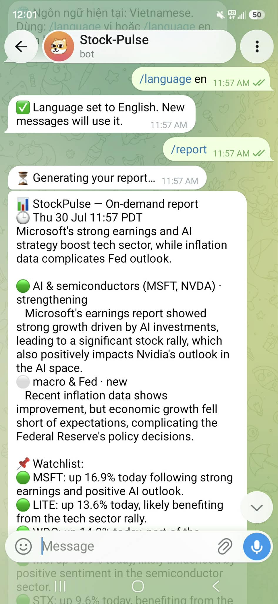
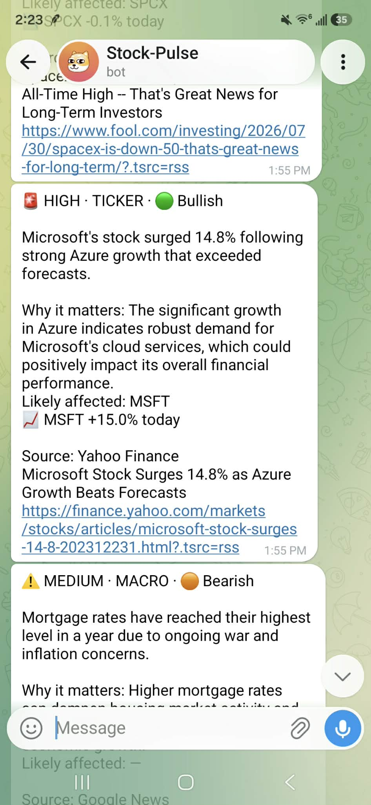
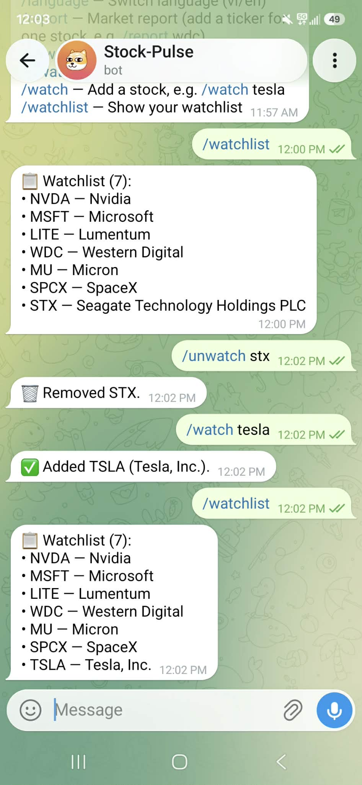
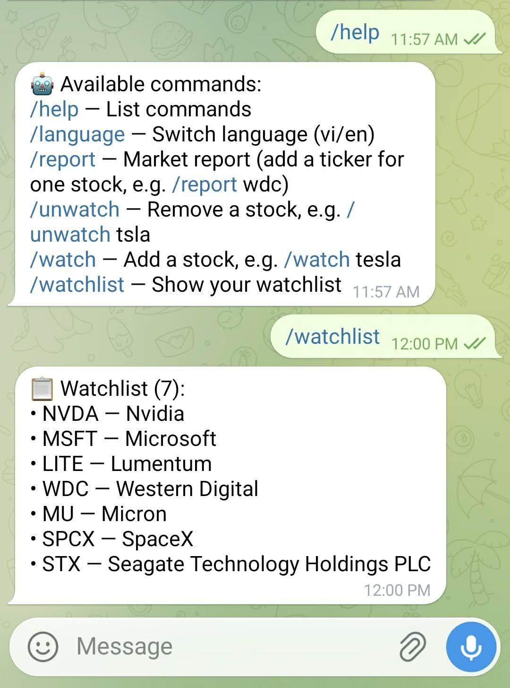
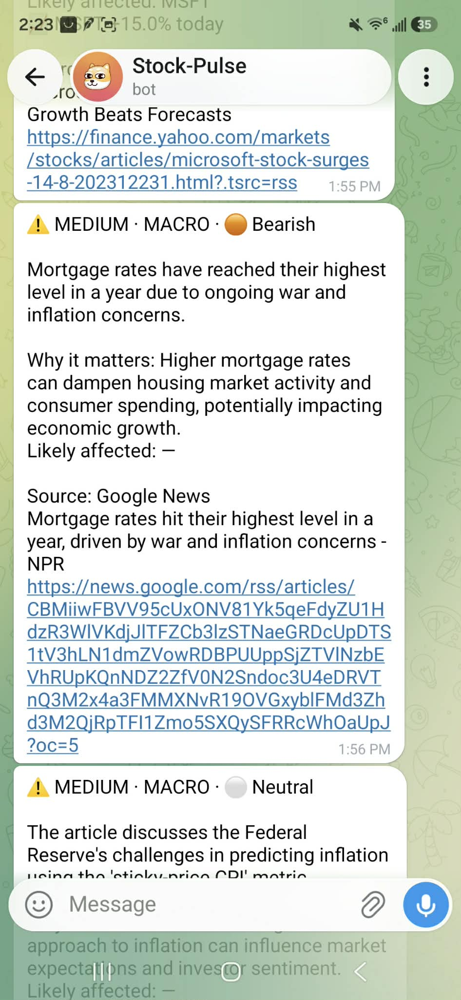

<h1 align="center">📈 StockPulse</h1>

<p align="center">
  <b>Your personal market analyst, right inside Telegram.</b><br>
  It watches the financial news around the clock, works out what actually
  matters for <i>your</i> stocks, and pings your phone — so you don't have to
  stare at headlines all day.
</p>

<p align="center">
  🤖 AI-graded alerts&nbsp; · &nbsp;🗞️ on-demand briefings&nbsp; · &nbsp;💵 live prices&nbsp; · &nbsp;🌐 English / Tiếng Việt&nbsp; · &nbsp;☁️ runs 24/7 for under <b>$10/month</b>
</p>

---

## ✨ See it in action

<table>
  <tr>
    <td width="50%" align="center">
      <br>
      <b>A briefing whenever you want one</b><br>
      <sub><code>/report</code> → an AI analyst reads the latest news and tells you
      what matters, with live watchlist prices attached.</sub>
    </td>
    <td width="50%" align="center">
      <br>
      <b>Real-time news alerts</b><br>
      <sub>Each alert is graded by importance and sentiment
      (🟢 bullish / 🟠 bearish / ⚪ neutral) with a plain-English "why it matters".</sub>
    </td>
  </tr>
  <tr>
    <td width="50%" align="center">
      <br>
      <b>Manage everything by chat</b><br>
      <sub>Add or drop stocks on the fly — <code>/watch tesla</code>,
      <code>/unwatch stx</code> — no config files, no restart.</sub>
    </td>
    <td width="50%" align="center">
      <br>
      <b>Simple commands</b><br>
      <sub><code>/help</code>, <code>/watchlist</code>, <code>/language</code> …
      everything is one tap away.</sub>
    </td>
  </tr>
</table>

<p align="center">
  <br>
  <sub>Macro &amp; Fed news too — not just your tickers.</sub>
</p>

---

## Why StockPulse?

- **It reads for you.** An AI model judges every headline for importance,
  category, sentiment, and which of your tickers it touches — so you only hear
  about what moves the needle.
- **A secretary that briefs you.** Scheduled morning / intraday / end-of-day
  briefings, plus `/report` any time (the whole watchlist, or one stock like
  `/report wdc`), each with open + current prices and honest freshness labels.
- **Respects your sleep.** Quiet hours hold non-urgent alerts overnight; only
  the truly critical breaks through.
- **Keeps itself honest.** A self-evaluation loop scores the AI's
  bullish/bearish calls against real price moves.
- **Runs from your pocket.** Manage the watchlist and switch language
  (English / Tiếng Việt) straight from Telegram — changes take effect live.
- **A native mobile app, too.** A React Native (Expo) app in
  [`mobile/`](mobile/) — Feed, on-demand Report, Watchlist, Settings, AI-accuracy,
  and **push notifications** — talking to the same backend over a token-guarded
  JSON API (`/api/*`). Telegram and push are independent, toggleable channels, so
  the app can be your primary surface with Telegram as backup (or off). See
  [`mobile/README.md`](mobile/README.md).
- **Cheap and low-maintenance.** A single always-on container on a small VPS,
  designed to run for under **$10/month**.

> **Status — live in production**, deployed 24/7 on a DigitalOcean droplet via
> Docker. Full product & technical plans are in
> [`specs/`](specs/) (all phases shipped) — start with the
> [Phase Guide](specs/STOCKPULSE_PHASE_GUIDE.md). To run your own, see
> [`DEPLOY.md`](DEPLOY.md) (+ [`BUYING_A_SERVER.md`](BUYING_A_SERVER.md) if it's
> your first server).

## Requirements

- Python 3.12+

## Setup

```bash
# Create and activate a virtual environment
python -m venv .venv
source .venv/Scripts/activate   # Windows (Git Bash);  use .venv/bin/activate on macOS/Linux

# Install the project with dev dependencies
pip install -e ".[dev]"

# Configure environment
cp .env.example .env            # then edit .env with real values
cp watchlist.example.json watchlist.json   # your tickers + company names
cp keywords.example.json keywords.json     # your macro + sector keywords

# Create the database (runs migrations)
alembic upgrade head
```

## Configuring what StockPulse watches

Two git-ignored JSON files control the rule filter. Edit them and **restart
the app** to pick up changes. If either file is missing, StockPulse falls
back to built-in defaults, so it always runs.

**`watchlist.json`** — tracked tickers and their company-name aliases (the
names that should also match in headlines):

```json
{
  "NVDA": ["Nvidia"],
  "MSFT": ["Microsoft"],
  "TSLA": ["Tesla"]
}
```

**`keywords.json`** — macro keywords and sector groups:

```json
{
  "macro": ["Federal Reserve", "CPI", "inflation", "tariff"],
  "sectors": {
    "AI/Semiconductor": ["AI", "semiconductor", "GPU"],
    "Crypto": ["bitcoin", "ethereum"]
  }
}
```

Omit a top-level key to keep its built-in default; use an empty list/object
to disable that part. Broad words like `oil` or `bank` can over-match — trim
them here if alerts get noisy.

### Language

Set `OUTPUT_LANGUAGE` in `.env` (e.g. `English`, `Vietnamese`, `Spanish`) to
choose the language the AI writes the summary and "why it matters" in.
Telegram alerts inherit it. Existing classifications keep their original
language; only new ones use the new setting.

### Alert message options

Each AI verdict also includes a **sentiment** — whether the news is good
(🟢 bullish, green ▲), bad (🟠 bearish, orange ▼), or neutral (⚪ →) for the
related stock. It shows on the news page next to the importance badge and in
the alert header. It's the AI's read of the news, not a price prediction.

The Telegram alert leads with the AI summary and "why it matters", then the
source and article title (the title is also in the link). Two `.env` toggles:

- `ALERT_INCLUDE_LINK` (default `true`) — include the article URL.
- `ALERT_LINK_PREVIEW` (default `false`) — show Telegram's link preview/
  thumbnail. Off keeps messages short.

## Run

```bash
uvicorn app.main:app --reload
```

Then check the health endpoint:

```bash
curl http://127.0.0.1:8000/health
# {"status":"ok","version":"0.1.0"}
```

Open http://127.0.0.1:8000/ for the news page and http://127.0.0.1:8000/alerts
for alert history.

> On Windows PowerShell, activate the venv first with
> `.\.venv\Scripts\Activate.ps1`, then the same `uvicorn` command. `Ctrl+C`
> stops the server. Use `--reload` only in development.

## Market Briefing ("the secretary")

A proactive analyst that pulls the **latest** news, decides what matters for
your watchlist (AI, semis, macro/Fed, geopolitics/war, energy), and reports it
— separate from the per-article alert flow. See
[specs/STOCKPULSE_BRIEFING_PLAN.md](specs/STOCKPULSE_BRIEFING_PLAN.md).

Three ways to get a briefing:

- **On demand — dashboard:** the **🗞️ Report now** button on the news page
  (or `POST /report`). Always answers, even on a quiet market.
- **On demand — Telegram:** send **`/report`** to your bot. Set
  `BRIEFING_COMMAND_ENABLED=true` (needs the server running to listen).
- **On demand — one stock:** send **`/report WDC`** (or a company name — even a
  typo, like `/report micosoft` or `/report spacex`). It narrows the news to
  that name and the AI resolves the ticker with common sense. Also
  `POST /report?q=WDC`.
- **Scheduled:** set `BRIEFING_ENABLED=true` (and `SCHEDULER_ENABLED=true`). On
  US-market/Pacific time, Mon–Fri: a full **08:30** morning brief, short
  **every-2h** updates (10:30–16:30), and an **18:00** end-of-day wrap.
  **Editable from the app** — Settings → Briefing schedule; see below.

### How a briefing is built

1. **Retrieve news** from the RSS collectors, limited to a look-back window that
   *differs per trigger* — the morning brief reaches back overnight, an intraday
   check-in only a couple of hours, so it doesn't re-report the morning's news.
2. **Fetch prices** — before the AI call, not after, so notable movers can be fed
   into the prompt. That's how a briefing can flag "MU −10% today" even when no
   headline explains it.
3. **One OpenAI call.** The analyst sees the news, the **prior themes** from
   rolling memory (`BRIEFING_MEMORY_HOURS`), the price moves, and — for a focused
   report — a hint about which stock you meant.
4. **Decide whether to send.** The anchors (morning, wrap) and anything you asked
   for always send. **Intraday check-ins only send if the AI reports a material
   update**, which is what stops "nothing much happened" arriving four times a day.
5. **Deliver** — rendered to text for Telegram, or shaped to JSON for the app.
6. **Record the themes** so the next run knows what it already told you and won't
   re-announce the same storyline as breaking news.

A **single-stock** report narrows the collectors to that name, uses a shorter
window, prices only that stock, and deliberately does **not** feed the theme
memory — a one-off lookup shouldn't pollute your watchlist's trend history.

Every report carries a **timestamp** (in `BRIEFING_TIMEZONE`) and an **open +
current price** line per relevant ticker (a full `/report` prices your whole
watchlist; a focused one prices that stock) with an honest **freshness label** —
`live` if the last trade is recent, otherwise the actual last-trade time (e.g.
`as of Fri 13:00 PDT`), since outside market hours a stock isn't trading and
there is no live price. Prices default to **Yahoo** (`BRIEFING_PRICE_SOURCE`) —
free, keyless, consolidated across venues and including pre/post-market, so it's
close to a phone stocks app; set it to `alpaca` to use the IEX feed instead.
Toggle the whole block with `BRIEFING_PRICES_IN_REPORT`.

### Changing the schedule

**From the app:** Settings → **Briefing schedule**. Set the morning time, how
often to check in, when check-ins stop, and the wrap time — or switch scheduled
briefings off entirely (on-demand `/report` keeps working). Saving reinstalls the
cron jobs immediately; **no restart needed**.

The times are validated before they're stored — they build cron triggers, and an
invalid one would stop the scheduler from starting at all.

> **The `.env` times are defaults, not the source of truth.** Once you save from
> the app, the saved values win. They live in `runtime_prefs.json` (inside the
> mounted `./data` volume in Docker, so they survive rebuilds). Clear that file
> and the `.env` values apply again.

Key settings (all in `.env`, see `.env.example`): `BRIEFING_TIMEZONE`
(defaults to `America/Los_Angeles`, independent of `TIMEZONE`),
`BRIEFING_MORNING_AT` / `BRIEFING_INTRADAY_UNTIL` / `BRIEFING_WRAP_AT` (starting
values for the above), the look-back windows, `BRIEFING_MODEL`, and
`BRIEFING_PRICES_IN_REPORT`.

### Web search (optional)

By default a briefing reasons only over the two RSS feeds — cheap, repeatable,
one OpenAI call. Set **`BRIEFING_WEB_SEARCH_ENABLED=true`** and the model also
searches the live web to confirm those headlines and find what the feeds missed,
then lists the pages it used as a clickable **Sources** block (in Telegram and in
the app).

```bash
BRIEFING_WEB_SEARCH_ENABLED=true
BRIEFING_MODEL=gpt-4.1-mini      # REQUIRED: gpt-4o-mini cannot search
```

Honest caveats, all observed in testing:

- **It costs more.** Web search runs on OpenAI's Responses API and adds a search
  tool charge on top of tokens, on every briefing — and briefings run ~6×/day.
- **`gpt-4o-mini` cannot search.** Use `gpt-4.1-mini`, `gpt-4.1` or `gpt-5.x`.
  The wrong model logs a warning at startup and the API rejects the call.
- **Sources are model-reported, not verified.** OpenAI only emits provable
  `url_citation` annotations for prose answers; ours is structured JSON, so the
  model lists the URLs itself. They're filtered to plausible http(s) links and
  de-duplicated, but a URL can still be a quote page rather than the article.
- **It's less repeatable.** Two runs minutes apart can differ, and occasionally
  the model returns malformed JSON (the analyst retries once).

## Telegram commands

With the listener on (`BRIEFING_COMMAND_ENABLED=true`), text these to your bot:

| Command | Does |
|---|---|
| `/report [ticker]` | Market briefing (add a ticker/name for one stock) |
| `/watchlist` | Show your watched tickers |
| `/watch tesla` | Add a stock (resolves the name → ticker via Yahoo) |
| `/unwatch tsla` | Remove a stock |
| `/language vi` | Switch AI output language — `en` or `vi` (others rejected) |
| `/help` | List the commands |

`/watch` and `/unwatch` edit `watchlist.json` and take effect immediately (news
+ reports pick up the change, no restart). `/language` switches the AI output
language between English (`en`) and Vietnamese (`vi`) live — the choice is saved
to `runtime_prefs.json` (in the `./data` volume under Docker) and overrides
`OUTPUT_LANGUAGE`; anything other than `en`/`vi` is politely rejected. All
commands are locked to your chat.

> **Docker note:** `docker-compose.yml` mounts `watchlist.json` **writable** so
> `/watch`/`/unwatch` can persist. (If you deployed before this, `git pull &&
> docker compose up -d --build` recreates the container with the new mount.)

## Running the pipeline

The full pipeline is **collect → dedupe → filter → classify → decide → alert**.

News comes from two sources, each on its own fetch cadence:

- **Watchlist** — Yahoo Finance per-ticker feeds (from `watchlist.json`),
  every `WATCHLIST_FETCH_INTERVAL_MINUTES` (default 5).
- **Macro** — a Google News search over your macro keywords, every
  `MACRO_FETCH_INTERVAL_MINUTES` (default 30).

How to run it:

- **Once, on demand:** `POST /run` (or the buttons on the news page) — runs
  both sources through one full cycle. The safe way to test.
- **Automatically:** set `SCHEDULER_ENABLED=true` in `.env`; the two sources
  run as independent scheduled jobs on their own intervals.

> ⚠️ Automatic mode spends OpenAI credit and sends Telegram messages on its
> own. `MAX_CLASSIFICATIONS_PER_RUN` and `MAX_ALERTS_PER_RUN` cap each run.

## Test

```bash
pytest
```

## Deploy (24/7)

StockPulse is a single always-on process (scheduler + Telegram listener + web),
so it wants a small always-on host, not serverless. A `Dockerfile` +
`docker-compose.yml` are included:

```bash
cp .env.example .env            # fill in keys + toggles
cp watchlist.example.json watchlist.json
cp keywords.example.json  keywords.json
docker compose up -d --build
docker compose logs -f
```

Full step-by-step for a cheap VPS (Docker install, SSH-tunnel to the dashboard,
updates, backups) is in **[DEPLOY.md](DEPLOY.md)**. Never bought a server
before? **[BUYING_A_SERVER.md](BUYING_A_SERVER.md)** walks you through choosing a
provider, SSH keys, and first login.

Two explainers on how the plumbing works, written to be read start to finish:
**[CI.md](CI.md)** (the robot that runs the tests on every push) and
**[STREAMING_AND_PROXIES.md](STREAMING_AND_PROXIES.md)** (why Predict updates
twice, and what a reverse proxy does to a live stream).

## Roadmap

Development proceeds one phase at a time (see the technical plan):

0. Project foundation ✅
1. News collection (RSS) ✅
2. Persistence & deduplication (SQLite) ✅
3. Rule-based filtering ✅
4. AI classification ✅
5. Alert decision engine ✅
6. Telegram notifications ✅
7. Scheduled end-to-end pipeline ✅
8. Quiet hours, price confirmation & self-evaluation ✅
9. Market briefing + on-demand /report ✅ (web search deferred)
10. Manage watchlist from Telegram (/watch /unwatch) ✅
11. Docker deploy ✅ · CI (todo)
12. Mobile app (Expo) + JSON API ✅ · push notifications ✅ · channel toggles ✅

Deferred / ideas: **AI prediction** (forward-looking 1w/1mo/3mo read —
[spec](specs/STOCKPULSE_AI_PREDICTION_PLAN.md)); multi-user / sign-in
([spec](specs/STOCKPULSE_MOBILE_APP_PLAN.md)); briefing **web search** (let the model pull news itself,
`BRIEFING_WEB_SEARCH_ENABLED`); AI-fallback name resolution for `/watch` typos;
GitHub Actions CI.
